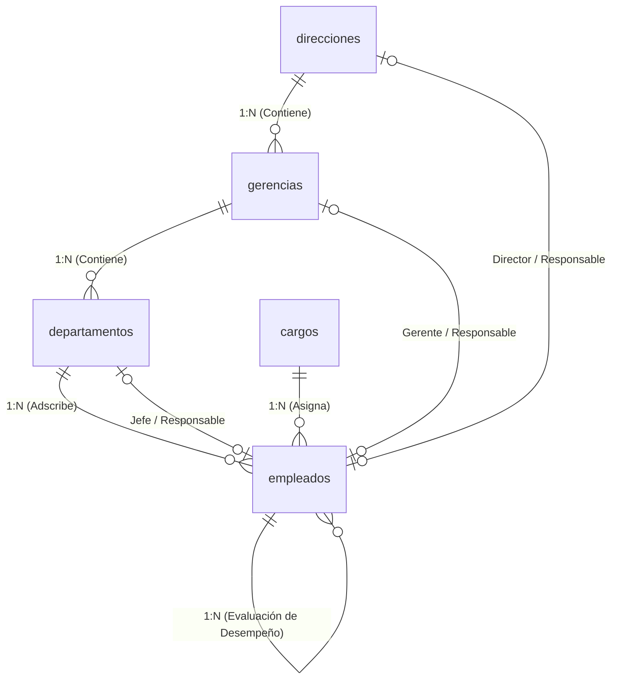

# Aplicación TH - Sistema de Gestión de Talento Humano

Plataforma web integral para la gestión de la estructura organizacional, catálogo de cargos, ficha de colaboradores, evaluación de desempeño y organigrama interactivo en tiempo real. Desarrollada con **React**, **Vite**, **TypeScript**, **Tailwind CSS** y backend Postgres BaaS en **InsForge**.

---

## 🚀 Características Principales

1. **🔐 Autenticación Completa con InsForge**:
   - Inicio de sesión con correo electrónico y contraseña.
   - Soporte para autenticación OAuth (Google y GitHub).
   - Registro de usuarios con soporte de verificación OTP de 6 dígitos enviado por correo.
   - Recuperación y restablecimiento de contraseña.
   - Modo de acceso rápido como Administrador TH (Demostración).

2. **🏢 CRUDs de Estructura Organizacional Multinivel**:
   - **Direcciones (Nivel 1)**: Catálogo de direcciones estratégicas y asignación de Directores Generales.
   - **Gerencias (Nivel 2)**: Unidades tácticas vinculadas a direcciones con asignación de Gerentes de Área.
   - **Departamentos (Nivel 3)**: Unidades operativas con asignación de Jefes de Departamento y conteo de colaboradores adscritos.

3. **👥 Ficha Maestra de Personal y Catálogo de Puestos**:
   - **Catálogo de Cargos**: Definición de títulos, descriptores de puesto y control de estado activo/inactivo.
   - **Ficha de Empleados**: Expediente completo (código, cédula/DNI, nombres, apellidos, correo, teléfono, cargo, departamento, supervisor directo, evaluador de desempeño específico y estado laboral: `ACTIVO`, `INACTIVO`, `VACACIONES`, `LICENCIA`).
   - **Ficha Ejecutiva**: Modal de consulta rápida con datos de contacto y estructura de mando.
   - **Historial de Traslados y Ascensos**: Trazabilidad cronológica de movimientos internos con vista tabular y línea de tiempo (*timeline*).

4. **🌳 Organigrama Interactivo y Vistas Especiales**:
   - **Árbol Jerárquico Visual**: Navegación dinámica expandible/colapsable (Dirección ➔ Gerencia ➔ Departamento ➔ Empleados).
   - **Explorador de Subordinados (RPC)**: Ejecución en vivo de la función recursiva PostgreSQL `sp_obtener_subordinados(p_supervisor_id)` para visualizar la cadena de mando directo e indirecto.
   - **Resumen de Responsables por Área**: Vista consolidada basada en `vw_resumen_responsables_area` con líderes y plantilla activa.
   - **Dashboard Ejecutivo**: Métricas en tiempo real de plantilla, tasa de actividad y accesos directos.

---

## 📐 Estructura de la Base de Datos



---

## 🛠️ Tecnologías Utilizadas

- **Frontend**: React 18, TypeScript, Vite, Tailwind CSS v3.4, Lucide Icons.
- **Backend**: [InsForge BaaS](https://insforge.dev) (PostgreSQL 15+, PL/pgSQL, PostgREST APIs, Auth JWT, Realtime).
- **SDK**: `@insforge/sdk` v1.5.1.
- **Repositorio**: [GitHub IAAsuarez26/Aplicacion-TH](https://github.com/IAAsuarez26/Aplicacion-TH).

---

## ⚙️ Instalación y Ejecución Local

### 1. Clonar el repositorio
```bash
git clone https://github.com/IAAsuarez26/Aplicacion-TH.git
cd Aplicacion-TH
```

### 2. Instalar dependencias
```bash
npm install
```

### 3. Configurar variables de entorno
Crea un archivo `.env` o `.env.local` en la raíz del proyecto:
```env
VITE_INSFORGE_URL=https://jj96rzs4.us-east.insforge.app
VITE_INSFORGE_ANON_KEY=anon_5a5f85153758df2568fcdfd16b5c70e958ba93aea7782df47d39f15f61aa5323
VITE_INSFORGE_APPKEY=jj96rzs4
```

### 4. Iniciar el servidor de desarrollo
```bash
npm run dev
```
Abre tu navegador en `http://localhost:5173`.

### 5. Compilar para producción
```bash
npm run build
```

---

## 📁 Estructura del Código Fuente

```
src/
├── App.tsx                     # Enrutador y renderizador de vistas
├── main.tsx                    # Punto de entrada con AuthProvider y ToastProvider
├── index.css                   # Tokens de diseño y estilos Tailwind CSS
├── vite-env.d.ts               # Tipos de entorno Vite
├── lib/
│   ├── types.ts                # Interfaces TypeScript para entidades y vistas
│   └── insforge.ts             # Cliente de @insforge/sdk y APIs CRUD
├── context/
│   └── AuthContext.tsx         # Contexto de autenticación y sesiones
└── components/
    ├── common/                 # Componentes reutilizables (DataTable, Modal, Toast, Badge)
    ├── layout/                 # Sidebar, Header y Layout principal
    ├── auth/                   # Pantallas de Login, Registro, OTP y Recuperación
    ├── dashboard/              # Panel de control y métricas KPI
    ├── direcciones/            # Módulo CRUD Direcciones (Nivel 1)
    ├── gerencias/              # Módulo CRUD Gerencias (Nivel 2)
    ├── departamentos/          # Módulo CRUD Departamentos (Nivel 3)
    ├── cargos/                 # Módulo CRUD Catálogo de Cargos
    ├── empleados/              # Módulo CRUD Ficha Maestra de Empleados
    ├── historial/              # Módulo CRUD Historial de Traslados
    ├── organigrama/            # Módulo de Organigrama y Explorador RPC
    └── responsables/           # Módulo de Resumen de Responsables por Área
```

---

## 🌩️ Backend InsForge

- **Proyecto vinculado**: `TH_PB` (`33a79d65-f707-47a3-bc5c-d9c88a729d2d`)
- **Host API**: `https://jj96rzs4.us-east.insforge.app`
- **Dashboard**: [InsForge Dashboard](https://insforge.dev/dashboard/project/33a79d65-f707-47a3-bc5c-d9c88a729d2d)
