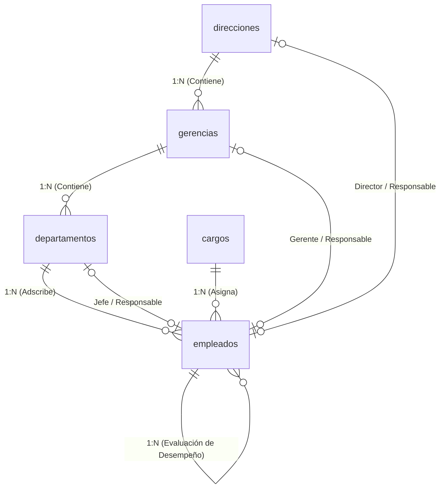

# Aplicación TH - Sistema de Gestión de Talento Humano

Este repositorio contiene el diseño de base de datos relacional y la configuración del backend en **InsForge** para la gestión de la estructura organizativa y el personal de la empresa.

---

## 📐 Estructura de la Base de Datos

El diseño soporta la gestión jerárquica de 3 niveles organizacionales, adscripción de empleados, roles, claves foráneas de responsabilidad por área y asignación de evaluadores de desempeño.

---

## 📁 Archivos del Proyecto

- 🟦 `schema_organizacional.sql`: Script DDL en **Microsoft SQL Server (T-SQL)**.
- 🐘 `schema_organizacional_pg.sql`: Script DDL en **PostgreSQL (PL/pgSQL)** desplegado en InsForge.
- ⚡ `AGENTS.md`: Guía de integración con el backend de InsForge (`TH_PB`).

---

## 📊 Vistas y Funciones Destacadas

1. **`vw_organigrama_completo`**:
   Correlaciona a cada empleado con su Dirección, Gerencia, Departamento, Cargo, Supervisor Directo y Evaluador Efectivo.
2. **`vw_resumen_responsables_area`**:
   Inventario unificado de todas las unidades organizativas con sus respectivos líderes asignados y recuento de personal activo.
3. **`sp_obtener_subordinados(p_supervisor_id)`**:
   Función recursiva para obtener la estructura completa de mando jerárquico bajo un supervisor determinado.

---

## 🌩️ Backend InsForge
- **Proyecto vinculado**: `TH_PB` (`33a79d65-f707-47a3-bc5c-d9c88a729d2d`)
- **Dashboard**: [InsForge Dashboard](https://insforge.dev/dashboard/project/33a79d65-f707-47a3-bc5c-d9c88a729d2d)
