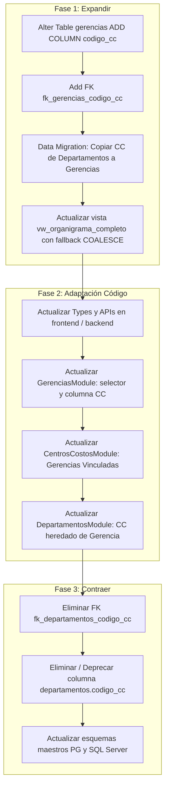

# Plan de Migración Arquitectónica: Vinculación de Centro de Costos a Gerencias

## Contexto y Diagnóstico Actual

En la arquitectura actual de la base de datos y de la aplicación:
1. **Modelo Vigente**: La tabla `departamentos` (Nivel 3) contiene la clave foránea `codigo_cc` que referencia a `centros_costos.codigo_cc`.
2. **Requerimiento**: El Centro de Costo no debe pertenecer a nivel de `departamentos`, sino a nivel de **`gerencias`** (Nivel 2 de la jerarquía organizacional).
3. **Comprobación de Datos Reales en InsForge (TH_PB)**:
   - Existen actualmente 36 departamentos y 23 gerencias.
   - Solo 2 departamentos tienen actualmente asignado un `codigo_cc`:
     - `Dep-0031` ("Sistemas y Tecnología") $\rightarrow$ Pertenece a `Ger-0002` ("Sistemas & Tecnología") con `codigo_cc = '01'`.
     - `Dep-0032` ("Talento Humano") $\rightarrow$ Pertenece a `Ger-0016` ("Talento Humano") con `codigo_cc = '02'`.
   - Esto confirma que el traspaso de datos hacia las gerencias correspondientes (`Ger-0002` y `Ger-0016`) es directo, exacto y sin conflictos.
4. **Vistas Afectadas**: La vista `vw_organigrama_completo` en PostgreSQL / SQL Server une `centros_costos` a través de `dep.codigo_cc`.

---

## Estrategia de Menor Impacto: Patrón *Expand & Contract*

Para garantizar **cero interrupción del servicio** y el menor impacto posible en la aplicación y los procesos contables/organizacionales, aplicaremos el patrón *Expand & Contract*:



---

## User Review Required

> [!IMPORTANT]
> **Comportamiento en Departamentos**:
> - En la pantalla de **Departamentos**, se **eliminará por completo cualquier información, columna, filtro o campo de Centros de Costos**, manteniéndola enfocada exclusivamente en su estructura departamental (Código, Nombre, Gerencia Padre, Jefe de Departamento y Estado).
> - La vinculación y visualización del Centro de Costo residirá **única y exclusivamente en la pantalla de Gerencias** (y en el catálogo maestro de Centros de Costos).
> - En la pantalla de **Centros de Costos**, la columna de relaciones mostrará **"Gerencias Vinculadas"** en lugar de departamentos vinculados, y la validación de eliminación protegerá contra el borrado de centros asignados a gerencias activas.
> - En la pantalla de **Gerencias**, se habilitará el selector de Centro de Costo (`01` al `15`) tanto en la creación/edición como en la tabla y los filtros.

> [!NOTE]
> La migración se diseñará y ejecutará en **PostgreSQL (InsForge backend activo)** y dejaremos disponible el script equivalente para **SQL Server** en el repositorio para mantener la paridad absoluta entre ambos motores.

---

## Proposed Changes

### 1. Base de Datos y Migraciones

#### [NEW] [migration_centros_costos_a_gerencias_pg.sql](file:///c:/Users/asuarez/Documents/GitHub/Antigravity/Aplicacion%20TH/migration_centros_costos_a_gerencias_pg.sql)
Script DDL / DML transaccional para PostgreSQL (InsForge):
1. Añadir columna `codigo_cc VARCHAR(20) NULL` a `public.gerencias`.
2. Crear clave foránea `fk_gerencias_codigo_cc` apuntando a `centros_costos(codigo_cc)` con `ON UPDATE CASCADE ON DELETE RESTRICT`.
3. Crear índice `idx_gerencias_codigo_cc` en `gerencias(codigo_cc)`.
4. Migración de datos:
   ```sql
   UPDATE gerencias g
   SET codigo_cc = dep.codigo_cc
   FROM departamentos dep
   WHERE dep.codigo_gerencia = g.codigo
     AND dep.codigo_cc IS NOT NULL
     AND g.codigo_cc IS NULL;
   ```
5. Recrear `vw_organigrama_completo` para unir `centros_costos` vía `g.codigo_cc` (manteniendo los nombres de columna `codigo_cc` y `centro_costo_descripcion` para compatibilidad de vistas y reportes).
6. Eliminar restricción foránea `fk_departamentos_codigo_cc` e índice `idx_departamentos_codigo_cc` de `departamentos`.
7. Eliminar columna `codigo_cc` de la tabla `departamentos`.

#### [NEW] [migration_centros_costos_a_gerencias_sqlserver.sql](file:///c:/Users/asuarez/Documents/GitHub/Antigravity/Aplicacion%20TH/migration_centros_costos_a_gerencias_sqlserver.sql)
Script equivalente para Microsoft SQL Server:
- `ALTER TABLE dbo.gerencias ADD codigo_cc VARCHAR(20) NULL;`
- `ALTER TABLE dbo.gerencias ADD CONSTRAINT FK_gerencias_centros_costos FOREIGN KEY (codigo_cc) REFERENCES dbo.CentrosCostos(Codigo_CC);`
- Traspaso de datos `UPDATE g SET g.codigo_cc = dep.codigo_cc FROM dbo.gerencias g INNER JOIN dbo.departamentos dep ON dep.gerencia_id = g.gerencia_id WHERE dep.codigo_cc IS NOT NULL;`
- Recreación de `dbo.vw_organigrama_completo`.
- Eliminación de `FK_departamentos_centros_costos` y columna `codigo_cc` de `dbo.departamentos`.

#### [MODIFY] [schema_organizacional_pg.sql](file:///c:/Users/asuarez/Documents/GitHub/Antigravity/Aplicacion%20TH/schema_organizacional_pg.sql)
- Actualizar definición DDL de la tabla `gerencias` para incluir `codigo_cc VARCHAR(20) NULL REFERENCES centros_costos (codigo_cc)`.
- Remover `codigo_cc` de la tabla `departamentos`.
- Actualizar índices y la definición de `vw_organigrama_completo`.

#### [MODIFY] [schema_organizacional.sql](file:///c:/Users/asuarez/Documents/GitHub/Antigravity/Aplicacion%20TH/schema_organizacional.sql)
- Actualizar definición DDL de `dbo.gerencias` y `dbo.departamentos` para reflejar el nuevo esquema en SQL Server.

---

### 2. Capa de Datos y Modelado de Tipos (Frontend / InsForge Client)

#### [MODIFY] [types.ts](file:///c:/Users/asuarez/Documents/GitHub/Antigravity/Aplicacion%20TH/src/lib/types.ts)
- En `interface Gerencia`:
  - Agregar `codigo_cc?: string | null;`
  - Agregar `centro_costo?: CentroCosto | null;`
  - Agregar `centro_costo_descripcion?: string | null;`
- En `interface Departamento`:
  - Retirar propiedad `codigo_cc`, `centro_costo` y `centro_costo_descripcion` de la interfaz `Departamento`.

#### [MODIFY] [insforge.ts](file:///c:/Users/asuarez/Documents/GitHub/Antigravity/Aplicacion%20TH/src/lib/insforge.ts)
- En `gerenciasApi`:
  - En `create`: incluir `codigo_cc: gerencia.codigo_cc ? gerencia.codigo_cc.trim() : null`.
  - En `update`: gestionar `payload.codigo_cc`.
  - En `update`: sanear payload para eliminar campos anidados como `centro_costo`, `centro_costo_descripcion`.
- En `departamentosApi`:
  - Remover por completo `codigo_cc` de `create` y `update`.

---

### 3. Módulos de Usuario (React Components)

#### [MODIFY] [GerenciasModule.tsx](file:///c:/Users/asuarez/Documents/GitHub/Antigravity/Aplicacion%20TH/src/components/gerencias/GerenciasModule.tsx)
1. **Carga de Datos**: Incorporar `centrosCostosApi.getAll()` en `loadData()`.
2. **Filtro**: Añadir selector de filtro por Centro de Costo (ej. filtrar gerencias por CC).
3. **Tabla de Gerencias**: Agregar columna con Badge visual del Centro de Costo asignado (`CC {g.codigo_cc} - {cc.descripcion}` o `Sin asignar`).
4. **Modal Formulario**:
   - Agregar campo `codigo_cc` con menú desplegable selectivo de centros de costo activos (`01` al `15`).
   - Cargar `codigo_cc` al abrir el modal en modo `edit` y limpiarlo en modo `create`.

#### [MODIFY] [CentrosCostosModule.tsx](file:///c:/Users/asuarez/Documents/GitHub/Antigravity/Aplicacion%20TH/src/components/costos/CentrosCostosModule.tsx)
1. **Carga de Datos**: Cargar `gerenciasApi.getAll()` en lugar de `departamentosApi.getAll()`.
2. **Columna "Gerencias Vinculadas"**: Reemplazar "Departamentos Vinculados" por "Gerencias Vinculadas" mostrando el conteo y los nombres de las gerencias que imputan a dicho centro.
3. **Filtro**: Reemplazar filtro por departamento por filtro por Gerencia.
4. **Validación de Borrado**: Validar que no se pueda eliminar un Centro de Costo si tiene **gerencias** asociadas.
5. **Textos y Subtítulos**: Actualizar texto informativo: *"Catálogo de centros de imputación financiera asignados a Gerencias (Nivel 2)"*.

#### [MODIFY] [DepartamentosModule.tsx](file:///c:/Users/asuarez/Documents/GitHub/Antigravity/Aplicacion%20TH/src/components/departamentos/DepartamentosModule.tsx)
1. **Remoción completa de Centros de Costos**:
   - Retirar importación y carga de `centrosCostosApi` y el estado `centrosCostos`.
   - Retirar la columna `codigo_cc` ("Centro de Costo") de la tabla `DataTable`.
   - Retirar el filtro `selectedCcFilter` y sus opciones del menú de filtros.
   - Retirar el campo `codigoCc` del modal de creación y edición.
   - Retirar `codigo_cc` de las claves de búsqueda rápida `searchKeys`.

---

## Verification Plan

### 1. Pre-Migración & Validación de Datos
- Comprobar que ningún proceso activo o inserción falle.
- Verificar conteo de centros de costo asignados antes de la ejecución.

### 2. Ejecución Controlada en InsForge (PostgreSQL)
- Ejecutar el script `migration_centros_costos_a_gerencias_pg.sql` a través de la herramienta InsForge `run-raw-sql`.
- Verificar con queries de prueba:
  - `SELECT codigo, nombre, codigo_cc FROM gerencias WHERE codigo_cc IS NOT NULL;` $\rightarrow$ debe retornar `Ger-0002` y `Ger-0016`.
  - `SELECT * FROM vw_organigrama_completo LIMIT 5;` $\rightarrow$ debe resolver correctamente sin errores de columna inexistente.

### 3. Verificación de Compilación y Tipado
- Ejecutar `npm run build` en el proyecto para asegurar que no existan errores de TypeScript (`tsc`) ni empaquetado de Vite.

### 4. Pruebas Funcionales en UI
- Abrir la aplicación y verificar:
  - Módulo **Gerencias**: Edición de una gerencia para cambiar o asignar CC; verificar que se guarda y se muestra en la tabla.
  - Módulo **Centros de Costos**: Comprobar que muestra las gerencias vinculadas y las estadísticas actualizadas.
  - Módulo **Departamentos**: Comprobar que al cambiar la gerencia de un departamento, el CC heredado se refleja correctamente.
  - Módulo **Organigrama**: Comprobar que los nodos y tarjetas de empleados siguen visualizando su centro de costo asignado a través de su gerencia.
